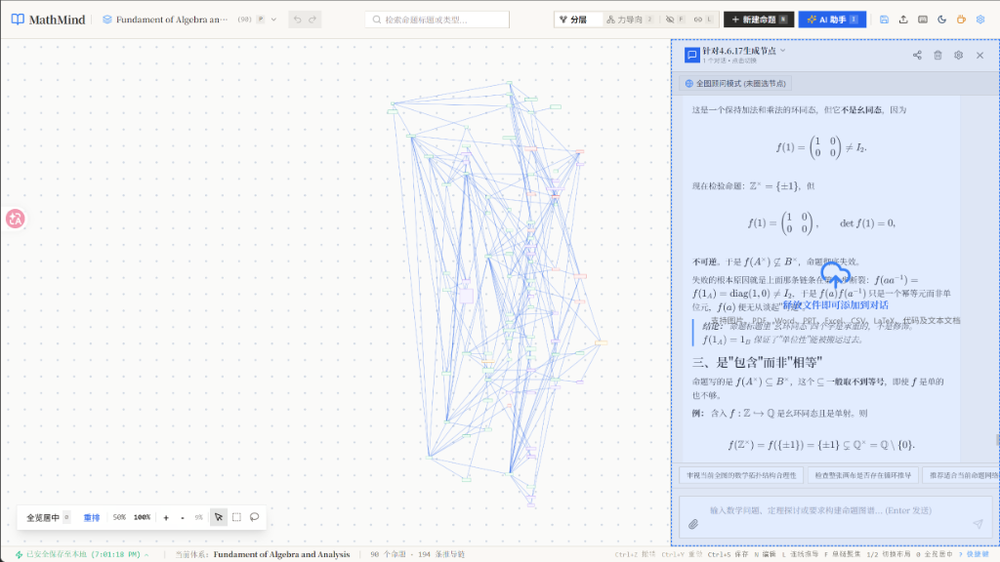
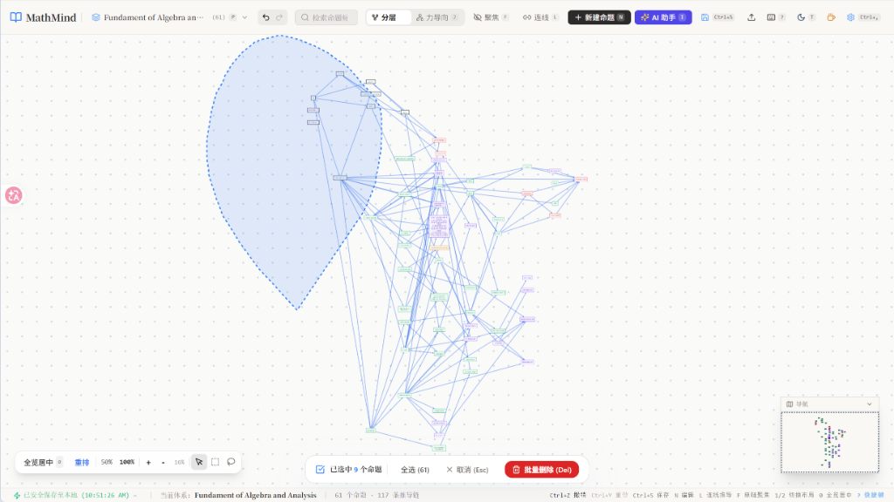

<div align="center">

# 📐 MathMind

### 一个在浏览器里梳理数学定理、公理与推导脉络的知识图谱工作台

面向数学与理论计算机科学学习者，将概念网络建模为**有向无环拓扑图 (DAG)**。<br />
从公理与定义出发，步步追踪严谨推演，理清概念因果脉络。

[](https://www.npmjs.com/package/mathmind)
[](LICENSE)
[](https://nodejs.org)
[](https://www.typescriptlang.org/)
[](https://vitejs.dev/)
[](https://katex.org/)

<br />



<p><em>▲ MathMind 工作台：有向拓扑逻辑图谱与右侧上下文感知 AI Copilot 侧边栏</em></p>

[⚡ 快速使用](#-快速使用) • [📊 工具横向对比](#-解决的问题与横向对比) • [✨ 主要功能](#-主要功能) • [⌨️ 快捷键](#️-常用快捷键) • [🥤 赞助支持](#-赞助)

</div>

---

## ⚡ 快速使用

本地安装了 Node.js (>= 18) 即可直接运行，无需克隆源码或配置环境：

```bash
npx mathmind
```
> 命令会自动启动轻量本地服务器并在几秒内唤起默认浏览器。

若作为常用工具，可全局安装为系统命令：
```bash
npm install -g mathmind
mathmind
```

> 💡 **国内网络或未安装 Node.js？** 请参阅 **[📖 常见系统 Node.js 安装与国内镜像换源指南](docs/INSTALL.md)**（包含 Windows / macOS / Linux 国内镜像下载直达与 npmmirror 加速设置）。

---

## 📊 解决的问题与横向对比

学数学或理论计算机时，概念与定理之间的前后依赖往往是复杂的网状关系（例如：一个定理通常需要两个前置公理和一个引理作为支撑）。

| 核心需求 | 传统文档 / Markdown | 传统思维导图 (Mindmap) | MathMind 命题因果图谱 |
| :--- | :---: | :---: | :---: |
| **底层数据结构** | 一维线性流 (Sequence) | 单根单一父子树 (Tree) | **有向无环图 (DAG)** |
| **多对多因果依赖** | ❌ 只能靠手写跳转，易逻辑断裂 | ❌ 无法表达“一个定理依赖多个前置” | ✅ **原生支持多前提汇聚与推论流向** |
| **数学公式排版** | ⚠️ 排版繁琐或静态渲染慢 | ❌ 绝大多数不支持 LaTeX 语法 | ✅ **KaTeX 毫秒级排版 + 实时渲染预览** |
| **算例与反例管理** | ❌ 混在正文中易冲淡主线证明 | ❌ 节点堆砌导致画布臃肿 | ✅ **每个命题结构化挂载独立算例** |
| **AI 上下文协同** | ❌ 脱离逻辑拓扑，盲目续写 | ❌ 缺乏网状结构感知能力 | ✅ **感知当前图谱上下文，辅助严密推导** |
| **离线与数据隐私** | ✅ 本地文件 | ⚠️ 多数依赖云端登录与同步 | ✅ **100% 存在浏览器本地，无需账号** |


---

## ✨ 主要功能

- 📐 **图谱画布**：支持公理、定义、命题、定理、推论、注记 6 种分类。支持分层排版（看推导先后流向）和力导向排版（看知识聚类），支持矩形框选与自由套索圈选批量操作。
- 💡 **算例与反例系统**：每个命题除了陈述、证明思路和详细证明外，还可以挂载多个具体的算例或特例反例，支持 LaTeX 公式。
- 🤖 **AI 辅助录入与推演**：支持粘贴文本、截图（`Ctrl+V`）或上传 PDF，调用大模型（Gemini、DeepSeek、Qwen、GLM 等）自动提取定理并尝试连线；也可唤起 Copilot 侧边栏辅助补充分步严密证明。
- 🏷️ **学习状态标记**：节点可标记为“存疑 ❓”、“重点 ★”、“需复习 🔄”、“已证毕 ✔”，方便备考复习与逻辑复盘。
- ⌨️ **全键盘操作**：常用动作均支持快捷键（`N` 新建、`E` 编辑、`L` 连线、`0` 全览等），聚焦输入框时自动挂起快捷键防冲突。
- 🎨 **工程矩形美学**：全局采用无多余装饰圆角的纯正矩形设计，内置白底、深灰、古典羊皮纸与教学黑板 4 种视觉材质。
- 🔒 **纯本地与隐私保护**：数据保存在浏览器本地（LocalStorage），无需注册登录，不上传数据。支持一键导出/导入 JSON 备份，以及导出高清 PNG 图片。

<div align="center">
  
  <p><em>▲ 自由套索圈选（Lasso）与批量操作</em></p>
</div>

---

## ⌨️ 常用快捷键

| 按键 | 功能 | 说明 |
| :--- | :--- | :--- |
| `N` / `Ctrl + N` | 新建命题 | 唤起创建弹窗 |
| `E` | 阅读 / 编辑模式切换 | 在命题详情弹窗中切换 |
| `Ctrl + Enter` | 保存修改 / 提交新建 | 确认保存并更新图谱 |
| `Esc` | 取消 / 关闭 | 取消编辑、关闭弹窗、退出连线模式 |
| `L` | 依赖连线模式 | 开启后点击两个节点快速建立因果连线 |
| `B` / `Shift + 拖拽` | 矩形框选 | 批量选中区域内的命题 |
| `Alt + 拖拽` | 自由套索圈选 | 不规则手绘圈选命题 |
| `1` / `2` | 切换布局 | 1 为分层 Dagre，2 为力导向 CoSE |
| `0` / 双击空白 | 画布全览居中 | 平滑聚焦全局图谱 |
| `+` / `-` | 缩放画布 | 放大或缩小视野 |
| `T` | 切换主题 | 切换亮色与暗色模式 |
| `Ctrl + P` | 体系管理 | 切换或新建不同的数学分支体系 |
| `Ctrl + ,` | 系统设置 | 配置主题、材质与 AI 模型参数 |
| `Shift + I` | AI 智能提取 | 唤起教材与截图多模态抽取 |
| `?` | 快捷键对照表 | 查看完整键盘映射 |

---

## 🛠️ 本地开发

```bash
# 克隆仓库
git clone https://github.com/theordinary0x/Mathmind.git
cd Mathmind

# 安装依赖
npm install

# 启动开发服务器
npm run dev

# 静态类型检查与生产打包
npx tsc --noEmit
npm run build
```

---

## ⭐ 支持项目

如果 MathMind 对你的数学学习、逻辑整理或科研推导有所帮助，欢迎在 [GitHub 仓库](https://github.com/theordinary0x/Mathmind) 点个 **Star** 支持！

---

## 🥤 赞助

全部打赏收入将用于购买作者的奶茶：

<div align="center">
  <br />
  
  <p style="margin-top: 8px; font-size: 13px; color: #666;">支付宝扫码赞赏</p>
</div>

---

## 📄 License

本项目基于 [MIT](LICENSE) License 开源。
