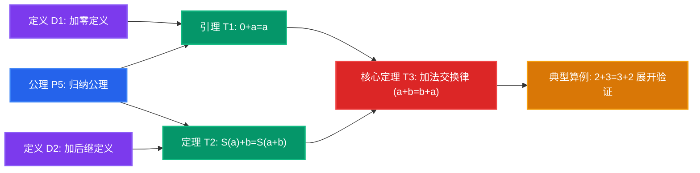

<div align="center">

# 📐 MathMind

### 基于 Web 的数学公理推演与命题因果拓扑图谱工作台

面向数学、物理与理论计算机科学学习者，将高密度数学体系建模为**有向无环拓扑网络 (DAG)**。<br />
从公理与原始定义出发，步步追踪严谨推导，构建牢不可破的逻辑认知骨架。

[](https://www.npmjs.com/package/mathmind)
[](LICENSE)
[](https://nodejs.org)
[](https://www.typescriptlang.org/)
[](https://vitejs.dev/)
[](https://katex.org/)

<br />


<p><em>▲ MathMind 工作台全览：有向无环拓扑因果画布与右侧上下文感知 AI Copilot 侧边栏</em></p>

[⚡ 快速运行](#-快速运行) • [📊 为什么是-mathmind](#-为什么是-mathmind) • [✨ 核心特性](#-核心特性) • [⌨️ 快捷键参考](#️-快捷键参考) • [🥤 赞助支持](#-赞助与支持)

</div>

---

## ⚡ 快速运行

无需克隆源码、无需配置构建环境，只要本地安装了 Node.js (>= 18)，在终端执行以下命令即可自动启动轻量本地服务器并唤起默认浏览器：

```bash
npx mathmind
```

若作为高频本地工具，推荐全局安装为系统命令行命令：
```bash
npm install -g mathmind
mathmind
```

---

## 📊 为什么是 MathMind？

传统笔记工具与思维导图在记录高密度、深层级的数学体系时存在结构性缺陷：

| 维度 | 传统长文档 / Markdown | 传统思维导图 (Mindmap) | MathMind 命题因果图谱 |
| :--- | :--- | :--- | :--- |
| **底层拓扑结构** | 一维线性排列（逐行阅读） | 单根单一父子树（Tree） | **有向无环拓扑图（DAG）** |
| **因果多对多依赖** | 只能靠超链接跳转，易逻辑断裂 | 无法表达“一个定理需要多个前提公理” | **自然支持多前提汇聚与多分支结论推演** |
| **数学公式排版** | 静态排版或渲染缓慢 | 绝大多数不支持 LaTeX 语法 | **KaTeX 毫秒级矢量排版 + 实时渲染预览** |
| **算例与反例** | 穿插在长文中，易冲淡主干 | 节点过长导致画布臃肿 | **每个命题结构化挂载独立算例与反例卡片** |
| **AI 辅助推演** | 盲目续写长文本，无视逻辑链 | 无结构感知能力 | **感知当前图谱上下文，辅助推演严格分步证明** |



---

## ✨ 核心特性

### 1. 📐 严格的拓扑推演图谱与批量操作
- **5 类严谨数学实体**：公理 (Axiom)、定义 (Definition)、命题 (Proposition)、定理 (Theorem)、推论 (Corollary)。
- **双重工业级布局算法**：
  - **Dagre 分层因果流**：按照逻辑推导先后分层展开，因果链一目了然；
  - **CoSE 力导向聚类**：基于物理弹性力学算法自动聚类，清晰展现紧密相关的定理群落。
- **高效批量交互**：提供矩形框选（`Shift+拖拽` 或 `B`）与自由套索圈选（`Alt+拖拽`），支持多节点批量拖拽与批量删除。

<div align="center">
  
  <p><em>▲ 自由套索圈选（Lasso）与批量操作</em></p>
</div>

### 2. 💡 实例与算例系统 (Multi-Example)
- 每个命题支持附加任意数量的**具体算例、应用示范或特例反例**。
- **阅读视图**：以结构化编号卡片（例 1、例 2...）精美呈现，支持完整的 KaTeX 高精度排版。
- **编辑视图**：支持实时增删与预览，并与数学符号快捷输入工具栏联动。

### 3. 🤖 多模态 AI 教材智能录入与 Copilot
- **多模态教材提取**：粘贴教材文字、公式截图（`Ctrl+V`）或上传 PDF 讲义与论文。AI 自动解析其中的定理与证明，并智能感知已有画布节点建立拓扑依赖。
- **上下文感知 Copilot**：结合当前图谱上下文，协助分步补全严格数学证明（Full Proof）、检查推导漏洞、提供启发式变式。
- **全模型直连支持**：支持配置 Google Gemini、DeepSeek、阿里通义千问 (Qwen)、智谱 (GLM) 官方 API Key，请求本地直出。

### 4. 🏷️ 认知追踪与研读标记
- 支持 4 阶研读状态标记：
  - ❓ **存疑 (Doubt)**：证明存在跳步或尚未透彻理解；
  - ★ **重点 (Core)**：核心支柱定理或考试要点；
  - 🔄 **需复习 (Review)**：用于艾宾浩斯复习计划与逻辑复盘；
  - ✔ **已证毕 (Verified)**：推导已完全掌握与验证。

### 5. 🎨 纯直角工程美学与公式渲染
- 全局坚持纯直角几何与正交走线设计，消除多余装饰性圆角，保持数学的纯粹与严肃感。
- 内置 4 种沉浸式材质：**经典白底 (Paper)**、**极简深灰 (Dark)**、**古典羊皮纸 (Parchment)**、**教学黑板 (Chalkboard)**。

### 6. 🔒 本地离线与绝对隐私
- **零外部服务器依赖**：所有图谱数据、API Key 与草稿完全存储于浏览器本地，不上传任何隐私。
- **多体系隔离与无损导出**：支持独立管理多个学科项目，支持完整 JSON 备份与高清矢量 PNG 图片导出。

---

## ⌨️ 快捷键参考

| 快捷键 | 功能 | 说明 |
| :--- | :--- | :--- |
| `N` / `Ctrl + N` | 新建命题 | 唤起创建弹窗 |
| `E` | 阅读 / 编辑模式切换 | 在命题详情弹窗中切换 |
| `Ctrl + Enter` | 保存提交 | 确认保存修改 / 新建 |
| `Esc` | 退出 / 取消 | 取消编辑、关闭弹窗、退出连线 |
| `L` | 依赖连线模式 | 开启后点击两节点建立因果连线 |
| `B` / `Shift + 拖拽` | 矩形框选 | 批量选中区域内的命题 |
| `Alt + 拖拽` | 自由套索圈选 | 不规则圈选命题 |
| `1` / `2` | 切换布局 | 1 为分层 Dagre，2 为力导向 CoSE |
| `0` / 双击空白 | 全览居中 | 视口平滑聚焦全局图谱 |
| `+` / `-` | 缩放视口 | 放大或缩小图谱 |
| `T` | 切换主题 | 切换明亮与暗黑风格 |
| `Ctrl + P` | 项目管理 | 切换或新建不同的数学公理体系 |
| `Ctrl + ,` | 系统设置 | 配置主题、背景材质与 AI 模型参数 |
| `Shift + I` | AI 智能录入 | 唤起教材与截图多模态抽取 |
| `?` | 快捷键对照表 | 查看完整键盘映射 |

---

## 🛠️ 本地开发与构建

```bash
# 1. 克隆代码仓库
git clone https://github.com/theordinary0x/Mathmind.git
cd Mathmind

# 2. 安装依赖包
npm install

# 3. 启动 Vite 开发热重载服务器
npm run dev

# 4. 静态类型检查与生产构建
npx tsc --noEmit
npm run build
```

---

## 🥤 赞助与支持

全部打赏收入将用于购买作者的奶茶：

<div align="center">
  <br />
  
  <p style="margin-top: 8px; font-size: 13px; color: #666;">支付宝扫码赞赏</p>
</div>

---

## 📄 开源协议

本项目基于 [MIT License](LICENSE) 开源。欢迎 Star、Fork 与提交 Issue / PR 共同完善！
