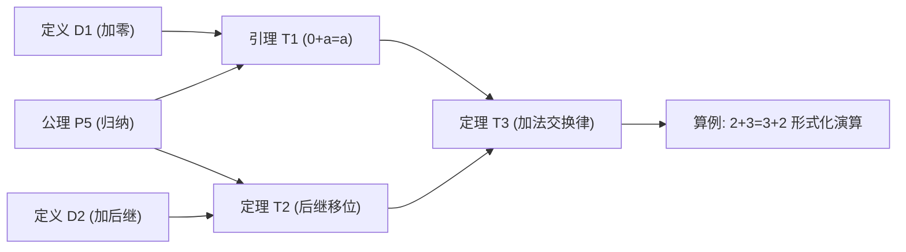

<div align="center">

# MathMind

一个在浏览器里梳理数学定理、公理与推导脉络的知识图谱工具。

[](https://www.npmjs.com/package/mathmind)
[](LICENSE)
[](https://nodejs.org)
[](https://www.typescriptlang.org/)
[](https://vitejs.dev/)

<br />


</div>

---

## 解决的问题

学数学或理论计算机时，概念之间的前后依赖经常是网状的（一个定理可能同时依赖两个公理和一个前置引理）。

- **普通长文档**是一维线性的，前后依赖全靠手写超链接，读到后面容易忘记前面；
- **思维导图**是单根树状的，没法画“多对多”的交叉依赖（一个子节点不能有两个父节点）。

MathMind 将其做成**有向无环图（DAG）**：节点代表公理、定义或定理，箭头代表因果推导，方便从源头理清每一步是怎么证出来的。



---

## 快速使用

本地有 Node.js (>= 18) 即可直接运行，无需克隆代码：

```bash
npx mathmind
```
终端会启动本地服务并自动打开浏览器。

如需常驻使用：
```bash
npm install -g mathmind
mathmind
```

---

## 主要功能

- **图谱画布**：支持公理、定义、命题、定理、推论 5 种分类。支持分层排版（看推导流向）和力导向排版（看知识聚类），支持矩形框选与自由套索圈选批量操作。
- **算例与反例**：每个命题除了陈述、思路和详细证明外，还可以挂载多个具体的算例或反例，支持 LaTeX 公式。
- **AI 辅助录入与推演**：支持粘贴文本、截图（`Ctrl+V`）或上传 PDF，调用大模型（Gemini、DeepSeek、Qwen、GLM 等）自动提取定理并尝试连线；也可唤起侧边栏让 AI 辅助补充证明。
- **学习状态标记**：节点可标记为“存疑 ❓”、“重点 ★”、“需复习 🔄”、“已证毕 ✔”，方便期末或科研复盘。
- **全键盘操作**：常用动作均有单键或组合键支持（如 `N` 新建、`E` 切换编辑、`L` 连线、`0` 全览等），打字时自动挂起避免冲突。
- **纯本地与离线**：数据存在浏览器 LocalStorage，不上传任何云端服务器，无需注册。支持导出/导入 JSON 备份，以及导出高清 PNG 图片。

<div align="center">
  
  <p><em>套索圈选与批量操作</em></p>
</div>

---

## 常用快捷键

| 按键 | 功能 |
| :--- | :--- |
| `N` / `Ctrl + N` | 新建命题 |
| `E` | 在详情弹窗中切换阅读 / 编辑模式 |
| `Ctrl + Enter` | 保存修改 / 提交新建 |
| `Esc` | 取消编辑 / 关闭弹窗 / 退出连线模式 |
| `L` | 开启 / 退出节点连线模式 |
| `B` / `Shift + 拖拽` | 矩形框选 |
| `Alt + 拖拽` | 自由套索圈选 |
| `1` / `2` | 切换布局（1: 分层，2: 力导向） |
| `0` / 双击空白 | 画布全览居中 |
| `+` / `-` | 放大 / 缩小画布 |
| `T` | 切换亮色 / 暗色主题 |
| `Ctrl + P` | 切换数学体系（项目管理） |
| `Ctrl + ,` | 打开系统设置与 API Key 配置 |
| `Shift + I` | 打开 AI 教材提取弹窗 |
| `?` | 查看完整快捷键对照表 |

---

## 本地开发

```bash
git clone https://github.com/theordinary0x/Mathmind.git
cd Mathmind
npm install
npm run dev     # 启动开发服务器
npm run build   # 生产打包
```

---

## 赞助

全部打赏收入将用于购买作者的奶茶：

<div align="center">
  
  <p>支付宝扫码</p>
</div>

---

## License

[MIT](LICENSE)
